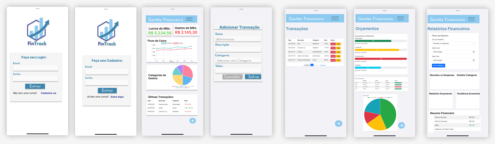

# FinTrack - Cuidando de suas finanças!

FinTrack é um site e aplicativo de gestão financeira projetado para ajudar os usuários a acompanhar e gerenciar suas finanças pessoais de maneira eficiente e intuitiva.

## Apresentação Slides:

https://my.visme.co/view/pvpe8yyo-fintrack

## bibliotecas utilizadas no mobile:

- **chart-kit** = gráficos sem interferencia com a expo.
- **validator** = validação do usuario.
- **async-storage** = segurança para o usuario.
- **picker** = escolhas de categorias.

## Tecnologias Utilizadas:

| Teconologias               | Linguagens |               
| ----------------- | -------------|
| Front-end      |  JavaScript, Bootstrap, HTML e CSS |
| Back-end       |  Node, Express, Prisma e JWT |
| Teste       |  Insomnia |
| Back e Front     |  VsCode |
  Banco      |   Xampp e Prisma
| Mobile | React, Yarn, Expo | 

## Instalação Web:

1. Clone este repositorio e abra com o VsCode:

```bash
 https://github.com/lehhofman/FinTrack-Financas.git
```
2. Entre na pasta api:
```bash
  cd api
```
3. Crie um arquivo .env contendo:
```bash
  DATABASE_URL="mysql://root:@localhost:3306/FinTrack"
  KEY="base64q3
```
4. Abra o Xampp e inicie o mysql e o apache 
5. Inicie e instale as dependencias e o banco de dados no VsCode:
```bash
  npm i
  npx prisma migrate dev --name fintrack init
```
6. Execute a api:
```bash
  nodemon
```

## Instalação Mobile:

1. Clone este repositorio e abra com o VsCode:

```bash
  git clone https://github.com/Carla-coder/proj1.git
```

2. Inicie o projeto:

```bash
  yarn install
```

3. Instale as dependencias: 
```bash
  yarn add @react-navigation/native
  yarn add @react-navigation/bottom-tabs
  yarn add @react-navigation/stack
  yarn add @expo/vector-icons@react-native-picker/picker
  yarn add @react-native-async-storage/async-storage
  yarn add react-native-vector-icons/FontAwesome
  yarn add validator
  yarn add react-native-chart-kit

```

3. Execute o projeto:
```bash
  yarn start
```
## Documentação de cores:

| Cor               | Hexadecimal |               
| ----------------- | -------------|
| Cor 1       |  #c2be99 |
| Cor 2       |  #ceceb1 |
| Cor 3       |  #284767 |
| Cor 4       |  #376f7b |
  Cor 5       |   #7ebab6

## Protótipo:

O protótipo do projeto pode ser visualizado [neste link do Figma](https://www.figma.com/proto/4tw77ZcwhrmvqBoFfoC385/FinTrack?node-id=0-1&t=sBvlsGLJ3tiAyYAH-1).

## Wireframes:



# FinTrack - Roteiro de Testes

Este documento contém o roteiro de testes para o aplicativo FinTrack, que auxilia os usuários a gerenciarem suas finanças pessoais. Os testes incluem a verificação das funcionalidades principais, responsividade e feedback do usuário.

## 1. Teste da Tela de Login

### Objetivo
Verificar se o sistema permite adicionar um e-mail e senha corretamente.

### Passo 1
- [ ] Acesse a aplicação.
- [ ] Preencha o campo "e-mail" com um título válido.
- [ ] Preencha o campo "senha" com seis dígitos.
- [ ] Clique no botão "Entrar".

### Passo 2
#### Objetivo
Caso o usuário esqueça a senha, poderá criar uma nova.

- [ ] Acesse a aplicação.
- [ ] Clique no campo "Esqueceu sua senha?".
- [ ] Preencha o campo "Digite seu e-mail" com um título válido.
- [ ] Preencha o campo "Digite sua nova senha" com seis dígitos.
- [ ] Clique no botão "Atualizar senha".
- [ ] Clique no botão "Fechar".

### Resultado Esperado
O usuário validado é direcionado para a tela Dashboard.

---

## 2. Teste da Tela de Cadastro

### Objetivo
Verificar se o usuário é direcionado para a página de cadastro.

- [ ] Acesse a aplicação.
- [ ] Clique no campo "Não tem uma conta? Cadastre-se".
- [ ] Preencha o campo "e-mail" com um título válido.
- [ ] Preencha o campo "senha" com seis dígitos.
- [ ] Preencha o campo "Confirme a Senha" com os mesmos seis dígitos.
- [ ] Clique no botão "Cadastrar".

### Resultado Esperado
Após o login, se os dados forem compatíveis com o cadastro, o usuário será direcionado para o aplicativo.

---

## 3. Teste da Tela de Dashboard

### Objetivo
Verificar a visualização de saldo atual e gastos.

### Passos
- [ ] O usuário visualiza dois gráficos: um de fluxo mensal e outro de distribuição de despesas.
- [ ] O usuário visualiza suas últimas três transações sempre atualizadas.

### Resultado Esperado
O usuário visualiza suas últimas três transações, saldo, gastos do mês e dois gráficos.

---

## 4. Teste da Tela de Transação

### Objetivo
Verificar se o sistema permite adicionar e editar uma transação.

### Passo 1: Adicionar Transação
- [ ] Na tela Dashboard, clique no botão “+” para adicionar uma transação.
- [ ] Preencha os campos necessários e clique no botão “Salvar”.

### Resultado Esperado
A transação é listada com as informações cadastradas.

### Passo 2: Editar Transação
- [ ] Na tela Transações, clique no botão “lápis” para editar uma transação.
- [ ] Preencha os campos necessários e clique no botão “Atualizar”.

### Resultado Esperado
A tela de dashboard é atualizada conforme a transação editada.

---

## 5. Teste da Tela de Orçamentos

### Objetivo
Verificar a validação das entradas de orçamento.

### Passo 1: Adicionar Orçamento
- [ ] Acesse a tela Orçamentos.
- [ ] Clique no botão “+” para adicionar um orçamento.
- [ ] Preencha os campos e clique no botão “Salvar”.

### Passo 2: Editar Orçamento
- [ ] Clique no botão “Editar”.
- [ ] Preencha os campos necessários e clique no botão “Salvar”.

### Resultado Esperado
O sistema deve adicionar, editar ou excluir um orçamento e exibir as mudanças.

---

## 6. Teste de Relatório

### Objetivo
Verificar se o sistema mostra os Relatórios Financeiros por tipo.

### Passos
- [ ] Abra a tela Relatório.
- [ ] Selecione o Tipo de Relatório desejado.
- [ ] Clique no botão “Gerar Relatório”.

### Resultado Esperado
O sistema deve fornecer um resumo completo do relatório escolhido.

---

## 7. Teste de Responsividade

### Objetivo
Verificar se o layout é responsivo em diferentes tamanhos de tela.

### Passos
- [ ] Abra a aplicação em um navegador.
- [ ] Reduza a largura da janela para simular dispositivos móveis.

### Resultado Esperado
O layout deve se ajustar corretamente e permanecer funcional.

---

## 8. Teste de Feedback do Usuário

### Objetivo
Verificar se o sistema fornece feedback apropriado ao usuário.

### Passos
- [ ] Realize ações como login, cadastro, atualização de senha, adição ou edição de transações, orçamentos e relatórios.

### Resultado Esperado
- [ ] O sistema deve exibir mensagens de confirmação ou alerta em cada uma das ações mencionadas.

---

### Resultado Obtido
- [ ] A aplicação possui um botão de atalho para “Voltar a tela anterior”.
- [ ] O sistema usa a navegação para ingressar entre telas.
- [ ] Possui um botão de “Sair do sistema” e voltar à “Tela de Login”.

---

Este roteiro de testes deve ser revisado e atualizado conforme novas funcionalidades sejam implementadas.

